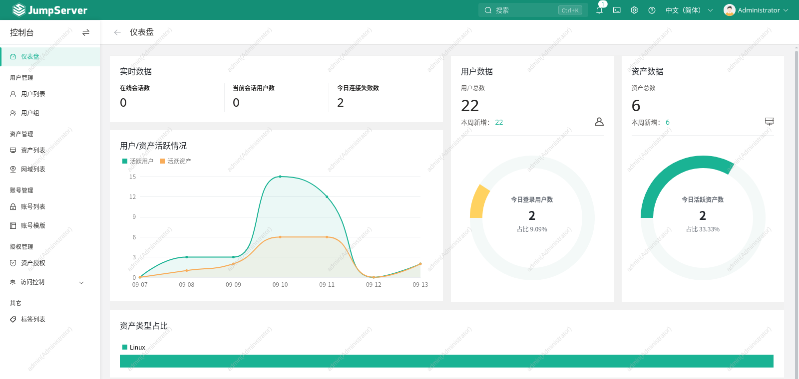
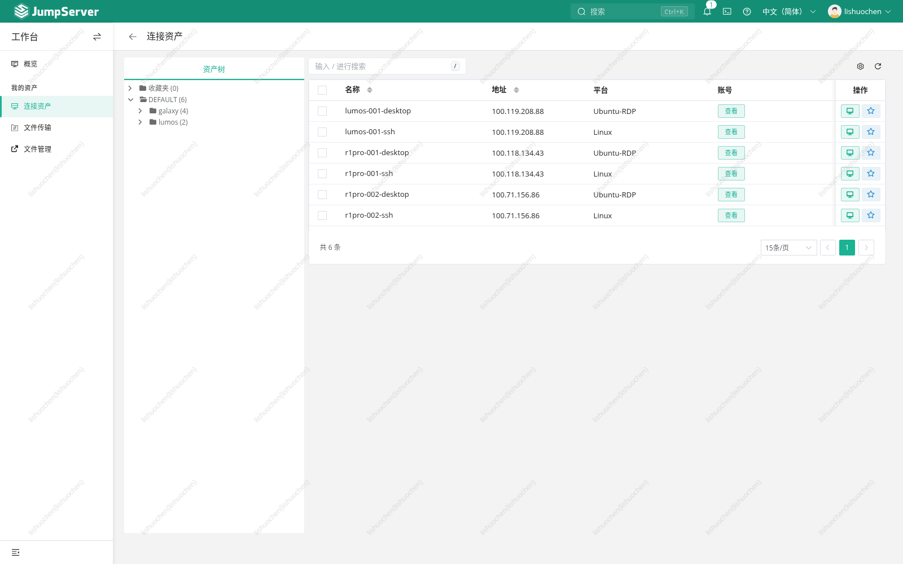

# 机器人开发环境堡垒机

面向团队的 JumpServer 社区版部署与 Ubuntu 下位机接入源码：通过网页终端、远程桌面、个人账号授权和会话审计，统一进入机器人开发环境。服务器采用 JumpServer v4.10.19-ce，资产网络采用 Tailscale，下位机提供普通 OpenSSH 与 xrdp。

私有仓库目标：`lsclsc2026/u_robot_jumpserver`。资料整理于 2026-09-13，来自本机交接包；这是源码和运维资料仓库，不是整机恢复包。





截图仅展示堡垒机网页，未连接资产、打开资产终端或执行设备命令。截图不代表 SSH、桌面、录像、防火墙或重启已完成实机验收。本轮不提供视频。更多页面见 [网页截图说明](docs/网页截图说明.md)。

## 能做什么

- 管理平台个人用户、用户组、资产账号和按节点/协议生效的授权。
- 通过 Koko 访问 SSH，通过 Lion 访问 RDP；同一设备分别建立终端和桌面资产。
- 用三个通用脚本完成 Tailscale 向导、Ubuntu GNOME/xrdp 配置与带定时回滚的 SSH/RDP 访问限制。
- 保留服务器安装、LAN 接入、执行镜像、诊断与历史修复源码，便于理解现有部署。

## 从哪里开始

| 任务 | 文档 |
|---|---|
| 理解组件、网络和信任边界 | [架构](docs/架构.md) |
| 准备服务器或接入一台 Ubuntu 设备 | [安装部署](docs/安装部署.md) |
| 修改地址、目录、版本和运行参数 | [配置参考](docs/配置参考.md) |
| 创建用户、资产和权限规则 | [用户资产与授权](docs/用户资产与授权.md) |
| 同事日常使用、向导阶段与收尾 | [使用手册](docs/使用手册.md) |
| 状态、故障、恢复和备份 | [运维手册](docs/运维手册.md) |
| 离线镜像获取与导入 | [离线镜像](docs/离线镜像.md) |
| 判断哪些是历史记录、哪些仍待验收 | [限制与验证边界](docs/限制与验证边界.md) |
| 每个脚本的用途和影响 | [脚本索引](inventory/脚本索引.md) |
| 原始资料取舍、字节变化和许可 | [来源与发布说明](docs/来源与发布说明.md) |

## 仓库结构

```text
code/local/           28 个本地脚本（含 5 个原有测试文件，仅保留未执行）
tools/                原有采集与传输工具，执行前需核对固定目标
upstream/             v4.10.19 安装器源码及原许可
examples/             空凭据、示例地址配置模板
inventory/            脚本索引与逐文件来源清单
offline/              7 镜像的名称、版本、摘要和元数据，不含镜像 tar
docs/                 中文部署、使用、运维说明及网页截图
```

新设备优先使用 `edge_wizard.py`、`setup_edge_desktop.py`、`edge_finalize.py`，三个文件须位于同一目录。服务器的 `install-jumpserver-laptop.py` 是带原主机名、USB UUID、目录和地址校验的历史专用安装器，不能直接用于任意新服务器。

示例配置不含凭据；真实用户 CSV、服务器原始快照、数据库、密钥、历史操作记录和大镜像均未提交。保留上游安装器的 [GPL-3.0 许可](upstream/jumpserver-installer-v4.10.19/LICENSE)，本仓库不新增覆盖所有内容的开源许可。
