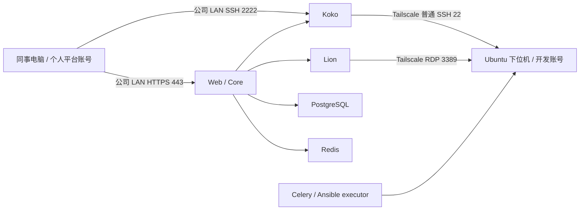

# 架构与数据流

[返回 README](../README.md)

## 服务器组件

| 组件 | 职责 | 本资料对应版本 |
|---|---|---|
| Web | 网页资源、反向代理、HTTPS 入口 | v4.10.19-ce |
| Core | 用户、资产、授权、审计/API | v4.10.19-ce |
| Celery | 使用 Core 镜像运行后台任务 | v4.10.19-ce |
| Koko | SSH 网关和终端连接 | v4.10.19-ce |
| Lion | RDP 网关与桌面会话 | v4.10.19-ce |
| PostgreSQL | 业务数据库，包括凭据相关记录 | 16.15-bookworm |
| Redis | 缓存、任务等运行支撑 | 7.4.10-bookworm |
| Ansible executor | 资产自动化任务使用的执行镜像 | 历史 latest 标签，按固定 digest 获取 |

最初脚本仅启动六个服务，后续 `enable-jumpserver-gui.py` 加入 Lion。七个服务使用六种常驻镜像，另有一个 Ansible 执行镜像，因此归档是七个镜像。不能把最初六服务脚本当作后续部署的完整配置。

## 网络入口

公司 LAN 同事访问服务器 HTTPS 443 或 Koko 2222，不要求每个客户端加入 Tailscale。服务器经 tailnet 访问设备普通 SSH 22 和 RDP 3389。公司外如何进入公司 LAN 未在交接包中确认完成；私网地址不能直接作为公网入口。

通用收尾脚本创建独立 nftables `inet jms_edge_final` 表，只允许 `tailscale0` 接口上来自指定堡垒机 IPv4 的 TCP 22、3389；其他来源对这两个端口丢弃，包括 IPv6。其他流量默认放行，ping 成功并不与规则冲突。现存更严格的防火墙仍可能阻断访问。

Tailscale 负责设备间网络；这里的 SSH 是 Linux OpenSSH，并非把 Tailscale SSH 当成 JumpServer 替代品。平台用户控制“谁通过网关连接”，Linux 开发账号控制“在设备上能做什么”。

## 数据和信任边界

`/data/jumpserver` 保存数据库、审计和运行数据；实际凭据配置位于 `/opt/jumpserver/config`。数据库备份与原加密密钥须配套，独立保管。

共用一个 Linux 账号意味着共用文件、sudo、Docker 权限和桌面环境。拥有 root、完整 sudo 或 rootful Docker 权限的人仍可更改防火墙。本方案不隔离同账号桌面，也不承诺所有 ROS、控制 API 或其他远程工具都受到堡垒机审计。
