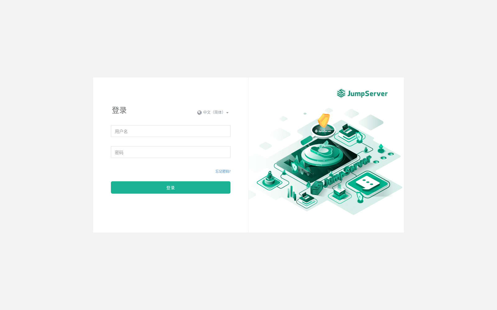
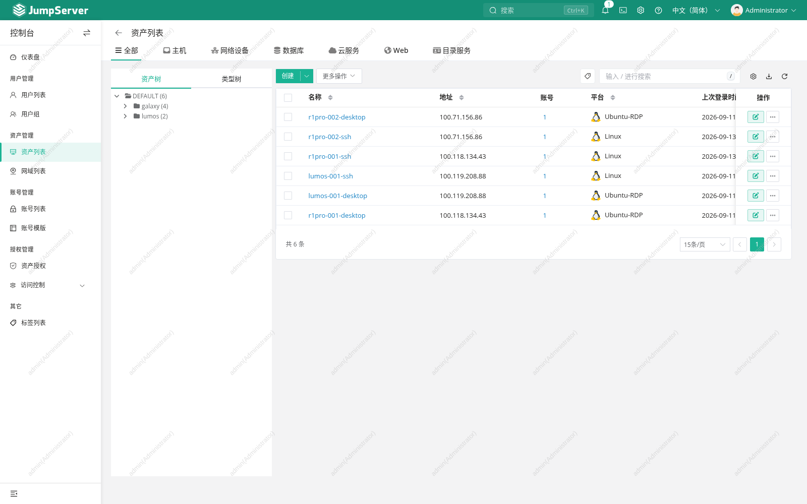
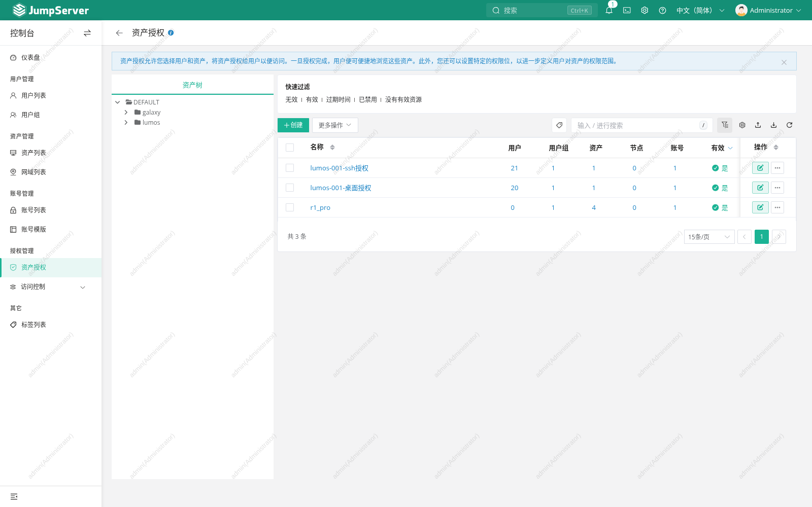

# 网页截图说明

[返回 README](../README.md) · [图片校验清单](screenshots/manifest.json)

2026-09-13 通过真实 JumpServer 网页截取，仅进行页面浏览。管理员概览只截取顶部统计区以避开同事排名；其余图片保留真实页面和平台水印，没有修改页面数据。两个账号均已退出，临时浏览器配置已清理。

页面显示 22 个用户、6 个资产、3 条授权规则，个人账号页面可见 6 个资产。这些数字只描述截图时界面内容，不证明任一资产在线、SSH/RDP 可连接或授权已经经过完整验收。

## 登录页面

## 管理概览

## 管理员资产列表

## 资产授权规则

## 个人用户资产页面

本轮未点击连接资产，未打开资产终端、RDP、文件管理或执行设备命令，也未录制视频。图片不作为桌面/终端/审计回放、防火墙、NoMachine 或重启验收材料。
